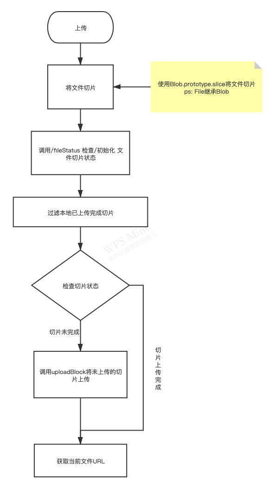

# 文件切片上传实现

之前看过相关文章但是一直没有动手实现，这个东西就是为了实现这个而产生的。

## 前端流程图


## 主要技术点

### 切片

1. 利用 `Blob.prototype.slice` 切片
2. 获取切片md5 作为唯一标识

#### 具体代码
```JavaScript
// 计算切片数量
const page = Math.ceil(file.size / size);
// 初始位置
let start = 0;
// 等待的异步任务队列
const promiseList = [];
for (let i = 0; i < page; i++) {
  // 计算当前切片的终止位置
  const end = start + size;
  const item = file.slice(start, end);
  // 更新 开始位置
  start = end;
  // 生成单个块 （异步）
  // const block = generateItemBlock(item, i);
  const block = {
    key:md5, // md5
    index:i, // index
    data: item // 切片数据
  };
}
```

### 合并

读取切片文件获取文件Buffer  
利用`Buffer.concat([b1,b2])`合并切片
```JavaScript
/**
 * 合并切片成文件
 * @param {String} filename 文件名
 * @param {Array} keys 切片id（临时文件名）列表
 */
async function mergeFile (filename, keys) {
  const readFile = util.promisify(fs.readFile);
  // 读取文件
  const files = keys.map(key => {
    return readFile(path.join(__dirname, '../files/', key));
  });
  // 异步等待结果
  const filesBuffer = await Promise.all(files);
  // NOTE: 合并切片
  const buffer = Buffer.concat(filesBuffer);
  // 写入
  fs.writeFileSync(path.join(__dirname, '../files/', filename), buffer);
  // 移除切片文件
  keys.forEach(key => {
    fs.unlink(path.join(__dirname, '../files/', key), function (err) {
      if (err) {
        throw err;
      }
    })
  });
}
```

### 文件容器管理

使用`lowdb`存储文件信息，使用文件md5作为文件id

#### 接口介绍

> POST /fileStatus 接口    

##### ReqData
```JSON
{
  "key": "", // 文件Md5
  "length": 0, // 切片数量
  "name": "" // 文件名称
}
```
##### ResData
```JSON
{
  "key": "", // 文件Md5
  "length": 0, // 切片数量
  "filename": "", // 文件名称
  "blocks": [], // 已完成的切片列表
  "url"?: "" // 文件M地址
}
```

#### 容器数据格式
```JSON
{
  "key": "", // md5
  "length": 0, // 切片数量
  "filename": "", // 文件名
  "blocks": []  // 已完成切片数量
}
```

#### 切片信息
```JSON
{
  "index": 0, // 切片下标
  "key": ""  // 切片 md5 我这里作同时作为切片文件名
}
```

### 切片管理

切片上传成功后需要管理标示，根据切片下标判断切片位置，通过文件容器判断切片上传状态，再将切片整合

#### 接口介绍

> POST /uploadBlock 接口    

##### ReqData

> Form Data  

```Form Data
key: 切片id
index: 下标
file: 切片数据
parent: 文件容器id
```
##### ResData
```JSON
{
  "code":200
}
```

## 异步请求优化
使用`async mapLimit`限制异步任务数量，避免一次性请求数量过多后导致进行中的请求过多，避免中断的时候浪费资源过多
```JavaScript
// 控制异步并发,避免块数量过多失败的时候导致成功数量变少
// 限制并发为3个
async.mapLimit(blocks, 3, async (file, callback) => {
  // 调用上传 块
  await uploadBlcok(file);
}, async () => {
  // 单任务执行完成后获取当前文件状态，可在这里获取文件地址
});
```

## 如何运行

1. 安装依赖  
```JavaScript
npm install
```
2. 运行
```JavaScript
npm run dev
```
3. 浏览器打开
```JavaScript
http://127.0.0.1:9870
```

## 相关资料

[浏览器文件MD5加密](https://github.com/forsigner/browser-md5-file)  
[async mapLimit](https://caolan.github.io/async/v3/docs.html#mapLimit)  
[前端大文件上传](https://juejin.im/post/6844903860327186445#heading-7)  
